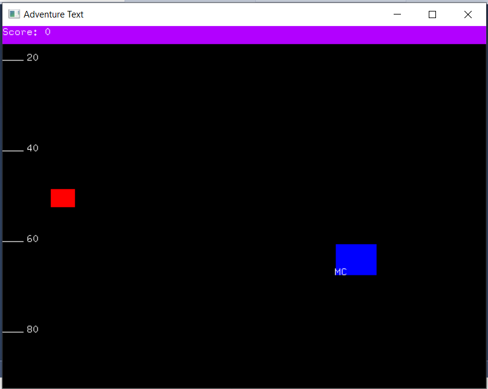

# TyperShark-Remake
## Description
This is a C++ project for TyperShark Remake Game using OpenGL and Glut.

## Features
* Implement 2D graphics using OpenGL and Glut library
* Implement Singleton system for game settings
* Apply dynamic memory allocation, objected-programming inheritance, delegation, structs

## Challenges
There is no challenge up until now.

## Programming Lanaguage
C++

## Major Components
* OpenGL

## Innovation
There is further plan to convert this project into modern OpenGL usage and improve the graphic with texture and sound effects.

## Project Information
* Source: https://github.com/tieuchanlong/TyperShark-Remake
* Online access: None
